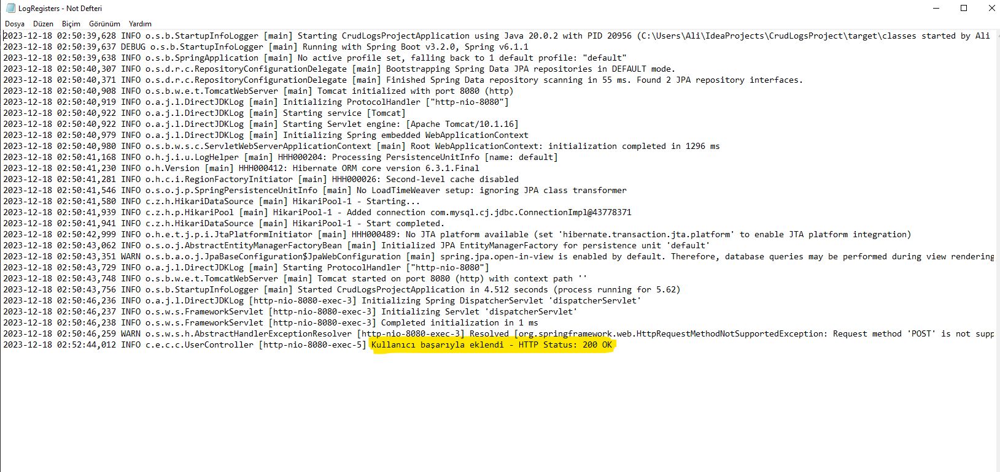

<h2>Spring Boot'da Log4j2 Kullanımı</h2>

<h3> Kullanılan Teknoloji </h3>
<ul>
<li>Java 17 </li>
<li>SpringBoot 3.2.0 </li>
<li>Spring JPA </li>
<li>Lombok </li>
<li>Log4j2 </li>

<li> MySQL Database</li>
</ul>

<p>Öncelikle pom.xml dosyamızda spring-boot-starter-web bağımlılığın içinde gelen spring-boot-starter-logging bağımlılığını exclude ediyoruz. Bunun yapılmasındaki temel amaç çakışmaları önlemektir</p>

```
<?xml version="1.0" encoding="UTF-8"?>
<project xmlns="http://maven.apache.org/POM/4.0.0" xmlns:xsi="http://www.w3.org/2001/XMLSchema-instance"
         xsi:schemaLocation="http://maven.apache.org/POM/4.0.0 https://maven.apache.org/xsd/maven-4.0.0.xsd">
    <modelVersion>4.0.0</modelVersion>
    <parent>
        <groupId>org.springframework.boot</groupId>
        <artifactId>spring-boot-starter-parent</artifactId>
        <version>3.2.0</version>
        <relativePath/> <!-- lookup parent from repository -->
    </parent>
    <groupId>com.example</groupId>
    <artifactId>CrudLogsProject</artifactId>
    <version>0.0.1-SNAPSHOT</version>
    <name>CrudLogsProject</name>
    <description>CrudLogsProject</description>
    <properties>
        <java.version>17</java.version>
        <maven.compiler.source>11</maven.compiler.source>
        <maven.compiler.target>11</maven.compiler.target>
        <project.build.sourceEncoding>UTF-8</project.build.sourceEncoding>
    </properties>
    <dependencies>

        <dependency>
            <groupId>org.springframework.boot</groupId>
            <artifactId>spring-boot-starter-log4j2</artifactId>
        </dependency>


        <dependency>
            <groupId>org.springframework.boot</groupId>
            <artifactId>spring-boot-starter-data-jpa</artifactId>
        </dependency>
        <dependency>
            <groupId>org.springframework.boot</groupId>
            <artifactId>spring-boot-starter-web</artifactId>
            <exclusions>
                <exclusion>
                    <groupId>org.springframework.boot</groupId>
                    <artifactId>spring-boot-starter-logging</artifactId>
                </exclusion>
            </exclusions>
        </dependency>

        <dependency>
            <groupId>com.mysql</groupId>
            <artifactId>mysql-connector-j</artifactId>
            <scope>runtime</scope>
        </dependency>
        <dependency>
            <groupId>org.projectlombok</groupId>
            <artifactId>lombok</artifactId>
            <optional>true</optional>
        </dependency>
        <dependency>
            <groupId>org.springframework.boot</groupId>
            <artifactId>spring-boot-starter-test</artifactId>
            <scope>test</scope>
        </dependency>
    </dependencies>

    <build>
        <plugins>
            <plugin>
                <groupId>org.springframework.boot</groupId>
                <artifactId>spring-boot-maven-plugin</artifactId>
                <configuration>
                    <excludes>
                        <exclude>
                            <groupId>org.projectlombok</groupId>
                            <artifactId>lombok</artifactId>
                        </exclude>
                    </excludes>
                </configuration>
            </plugin>
        </plugins>
    </build>

</project>

```
Ardından spring-boot-starter-log4j2 bağımlılığımızı projemize ekliyoruz

```
<?xml version="1.0" encoding="UTF-8"?>
<Configuration>
    <Appenders>
        <Console name="Console" target="SYSTEM_OUT">
            <PatternLayout
                    pattern="%style{%d{ISO8601}}{black} %highlight{%-5level }[%style{%t}{bright,blue}] %style{%C{1.}}{bright,yellow}: %msg%n%throwable" />
        </Console>

        <RollingFile name="RollingFile"
                     fileName="C:\Users\Ali\IdeaProjects\CrudLogsProject\LogRegisters.log"
                     filePattern="./logs/$${date:yyyy-MM}/spring-boot-logger-log4j2-%d{-dd-MMMM-yyyy}-%i.log.gz">
            <PatternLayout>
                <pattern>%d %p %C{1.} [%t] %m%n</pattern>
            </PatternLayout>
            <Policies>
                <!-- log dosyasının 10mb'a ulaştığında bir sonraki log dosyasının oluşturulmasını veya geçiş yapılmasını sağlar -->
                <OnStartupTriggeringPolicy />
                <SizeBasedTriggeringPolicy
                        size="10 MB" />
                <TimeBasedTriggeringPolicy />
            </Policies>
        </RollingFile>
    </Appenders>

    <Loggers>
        <!-- Her şeyi INFO seviyesinde loglayın -->
        <Root level="info">
            <AppenderRef ref="Console" />
            <AppenderRef ref="RollingFile" />
        </Root>


        <!-- proje içerisinde name = com.example.crudlogsproject olanları trace seviyesinde logla -->
        <Logger name="com.example.crudlogsproject" level="trace"/>
    </Loggers>

</Configuration>

```

<p>log4j2 dosyamız bizim loglama konfigürasyon dosyamızdır. Bu dosya içerisinde loglarımızın konsola nasıl basılacağını, hangi dosyaya hangi şekilde basılacağını ve hangi seviyedeki logların dikkate alınacağını bildiriyoruz</p>
<p>Bu dosyadaki konfigürasyonlar neticesinde proramımızda  belirttiğimiz dosya yoluna bir txt dosyası oluşacak ve aşağıdaki gibi görünecektir</p>


